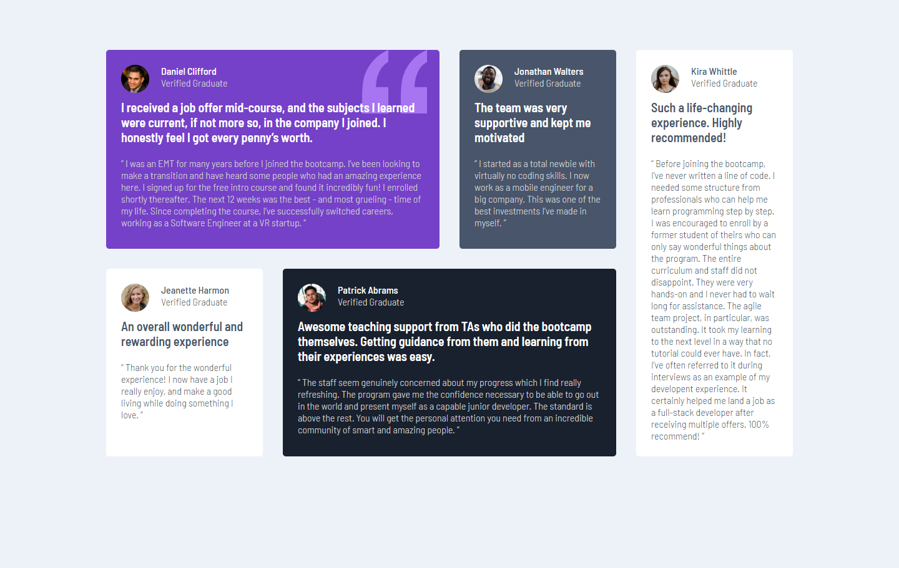
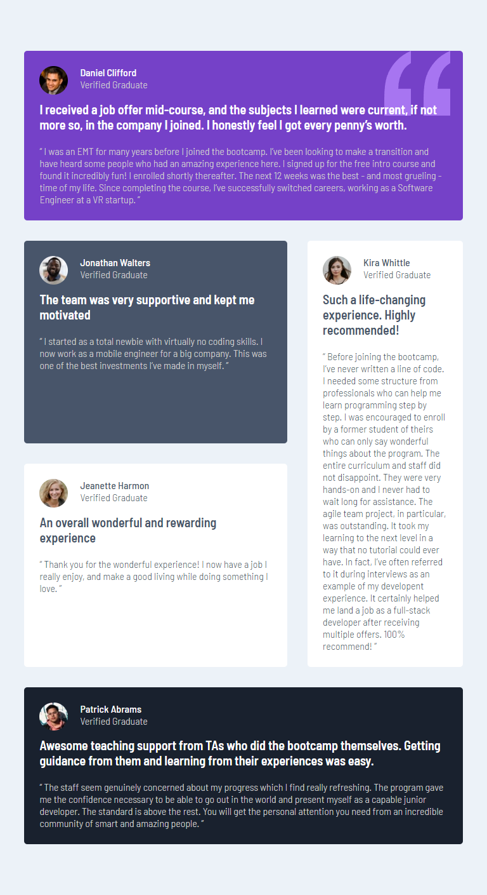

# Responsive Testimonial Grid

Welcome to this **Responsive Testimonial Grid** project! This repository contains a sleek and responsive grid layout designed to showcase testimonials or news articles. The layout is built using HTML and CSS Grid, ensuring it is both visually appealing and adaptable to various screen sizes.

## Features

- **Responsive Design**: The grid layout adjusts seamlessly to different screen sizes, ensuring optimal viewing on desktops, tablets, and mobile devices.
- **CSS Grid Layout**: Utilizes modern CSS Grid for a flexible and robust layout.
- **Customizable**: Easy to adapt for other types of content, such as news articles or portfolio items.
- **Stylish Design**: Clean and modern design with attention to typography and spacing.

## Screenshots

  
  

